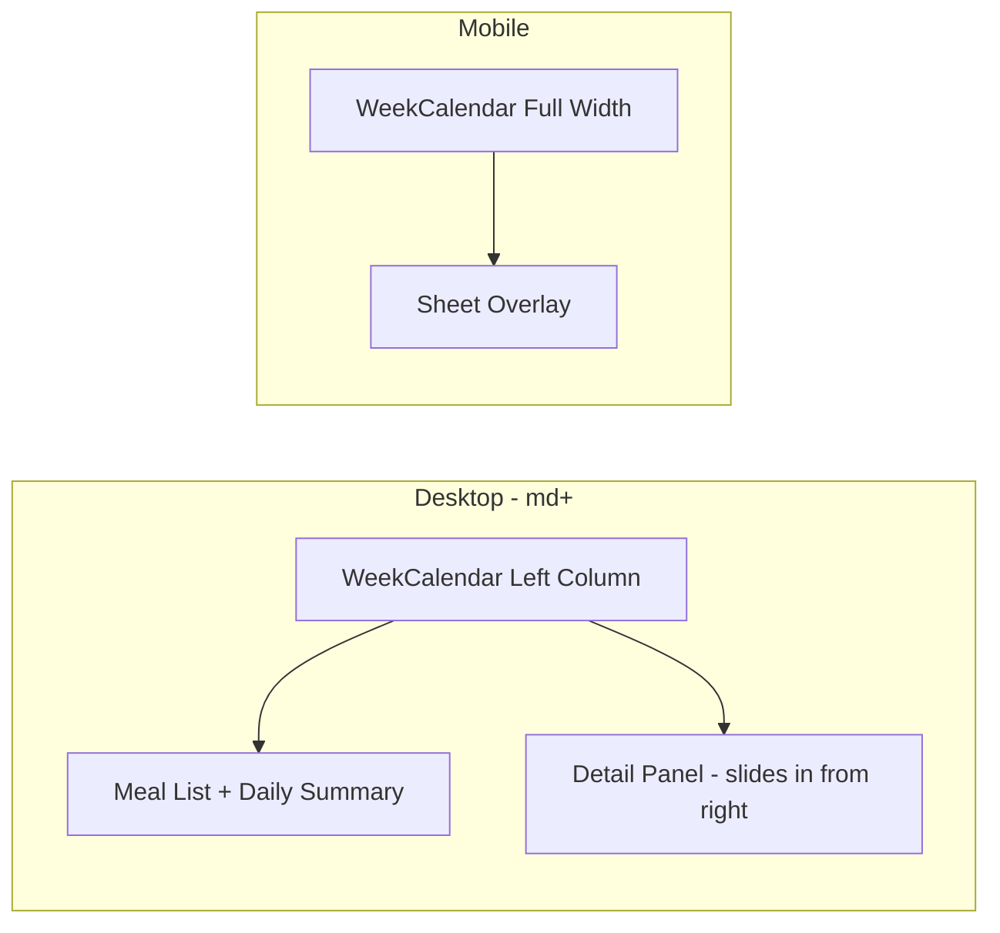

# Split-View Meal Detail — Implementation Plan

## Current Behavior

When a user clicks a [`MealBubble`](src/components/dashboard/MealBubble.tsx) in the [`WeekCalendar`](src/components/dashboard/WeekCalendar.tsx), a [`MealDetail`](src/components/dashboard/MealDetail.tsx) opens as a **Sheet** (a fixed overlay from the right). This Sheet blocks all interaction with the dashboard — the user can't scroll the meal list, switch days, or see anything behind the overlay.

## Desired Behavior

On **desktop** (md+ breakpoint), clicking a meal should slide the detail panel in from the right as a **split-view** — the meal list area narrows and the detail panel occupies a fixed-width column on the right. The user can still see and interact with the meal list and calendar on the left.

On **mobile**, the current Sheet overlay behavior is preserved.

## Architecture



### Approach: Responsive split within [`WeekCalendar`](src/components/dashboard/WeekCalendar.tsx)

The change is **localized to [`WeekCalendar.tsx`](src/components/dashboard/WeekCalendar.tsx)** and the [`MealDetail.tsx`](src/components/dashboard/MealDetail.tsx) component. No dashboard-level changes needed.

### Key Changes

1. **Refactor [`MealDetail`](src/components/dashboard/MealDetail.tsx) into two modes:**
   - **Sheet mode** (existing) — for mobile, keeps the `<Sheet>` wrapper
   - **Panel mode** (new) — for desktop, renders the same content in a scrollable `<div>` without the Sheet wrapper, with a slide-in CSS transition

2. **Modify [`WeekCalendar`](src/components/dashboard/WeekCalendar.tsx) layout:**
   - Wrap the existing content (day tabs, daily summary, meal list) in a left column
   - Add a right column for the detail panel (conditionally rendered when a meal is selected)
   - On `md+` screens: use `flex` layout with the detail panel sliding in from `translate-x-full` to `translate-x-0`
   - On mobile: hide the inline panel and use the Sheet instead

3. **Slide-in animation:**
   - Use Tailwind's `transition-transform duration-300 ease-in-out` with `translate-x-full` / `translate-x-0`
   - The panel width should be approximately `w-[380px]` or `w-1/3` on desktop

### Files to Modify

| File | Change |
|------|--------|
| [`src/components/dashboard/MealDetail.tsx`](src/components/dashboard/MealDetail.tsx) | Extract content into a reusable `MealDetailContent` component; add a `mode` prop to switch between Sheet and inline panel |
| [`src/components/dashboard/WeekCalendar.tsx`](src/components/dashboard/WeekCalendar.tsx) | Add responsive split-view layout; use inline panel on desktop, Sheet on mobile |
| [`src/app/globals.css`](src/app/globals.css) | Possibly add a `.scrollbar-hide` utility if not already present |

### Desktop Layout Sketch

```
┌──────────────────────────────────────────────────────┐
│  ◀ Week Nav ▶          [Today]                       │
│  [Mon] [Tue] [Wed] [Thu] [Fri] [Sat] [Sun]          │
├────────────────────────────────┬─────────────────────┤
│  Daily Summary                 │  Meal Detail Panel   │
│  ┌──────────────────────┐      │  ┌─────────────────┐│
│  │ Meal 1               │      │  │ Image            ││
│  ├──────────────────────┤      │  │ Name + Type      ││
│  │ Meal 2               │      │  │ Health Rating    ││
│  ├──────────────────────┤      │  │ Macros           ││
│  │ Meal 3               │      │  │ Edit/Delete      ││
│  └──────────────────────┘      │  └─────────────────┘│
├────────────────────────────────┴─────────────────────┤
│  (rest of dashboard below)                           │
└──────────────────────────────────────────────────────┘
```

## Implementation Steps

1. Extract the inner content of [`MealDetail`](src/components/dashboard/MealDetail.tsx) into a shared [`MealDetailContent`](src/components/dashboard/MealDetail.tsx) component
2. Modify [`MealDetail`](src/components/dashboard/MealDetail.tsx) to support two modes: `sheet` (default, for mobile) and `panel` (for desktop inline rendering)
3. Update [`WeekCalendar`](src/components/dashboard/WeekCalendar.tsx) to use a flex split layout on `md+` screens with the panel mode
4. Add slide-in CSS transition for the detail panel
5. Ensure the Sheet is still used on mobile screens
6. Verify no horizontal overflow from the new layout
